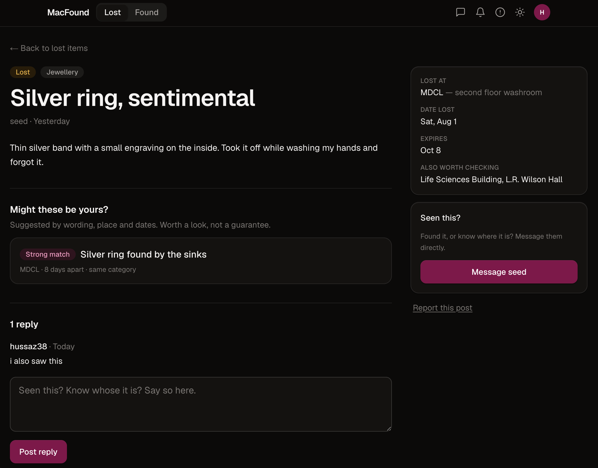
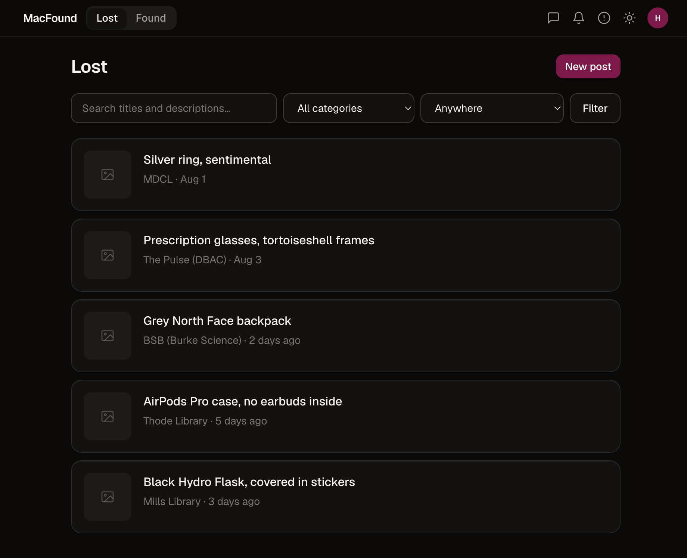
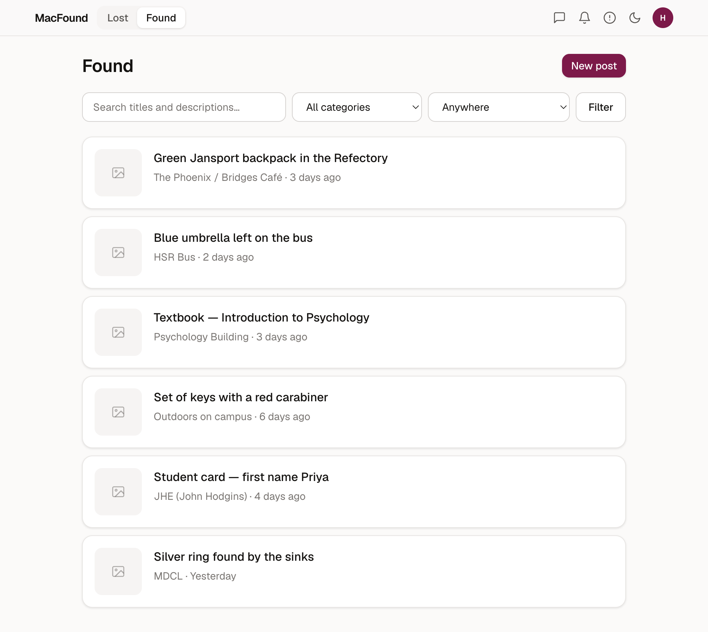
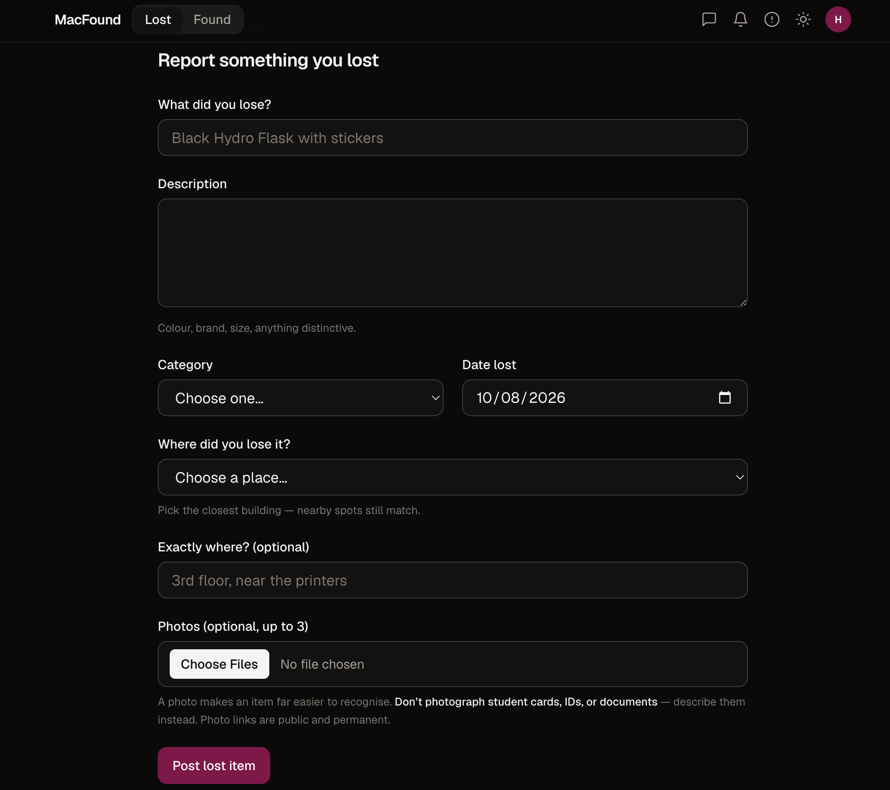

# MacFound

Lost & found for McMaster University students, with an automatic matching engine.

**Live:** [macfound.vercel.app](https://macfound.vercel.app) · sign-in requires a `@mcmaster.ca` address.

> A personal project. Not affiliated with, endorsed by, or operated by McMaster University.

---

## Screenshots

A lost ring, alongside the found post the matcher surfaced on its own — same
building, same category, eight days apart, scored as a strong match. Nobody
searched for this; it was waiting when the owner opened their post.



The two boards, in dark and light:

| Lost | Found |
| --- | --- |
|  |  |

Reporting something you've lost:



---

## The problem

Lost property on campus lives in Snapchat stories and Instagram reposts that vanish in 24
hours, or on a physical shelf in a building you never walk past. Someone finds a water
bottle in Thode on Monday; someone else posts "lost my water bottle" on Wednesday. Both
did the right thing. They never meet.

MacFound is a persistent, searchable board for both sides — and, more usefully, it tries
to introduce the two posts to each other on its own.

## What it does

- **Two boards** — lost and found, filterable by category, building and free text.
- **Automatic matching** — every new post is scored against the opposite board, and
  credible pairs surface on both posts and notify both people.
- **Claims** — a finder holding an item asks claimants to describe something identifying
  and judges the answer against the object in their hand.
- **Direct messages** — to arrange the handoff, without anyone posting a phone number.
- **McMaster-only accounts** — the domain restriction is the trust model.
- **Moderation** — reporting, plus a moderator queue for taking posts down.

## How the matching engine works

The interesting part, and most of the engineering.

Every post is compared against candidate posts of the opposite type within a 45-day
window. Four signals are combined into one score:

| Signal | Weight | How it's measured |
|---|---|---|
| Text | 0.40 | Postgres full-text search (`ts_rank`) plus trigram similarity (`pg_trgm`) |
| Category | 0.25 | Exact match on a 10-value enum |
| Location | 0.20 | Haversine distance between real building coordinates, linear falloff to 400m |
| Date | 0.15 | Directional — a found date must fall on or after the lost date |

Pairs scoring ≥ 0.35 are stored as suggestions; ≥ 0.55 also notifies both people.

Three details that only became obvious once it was running against realistic data:

**Location and date are corroborating evidence, not identifying evidence.** Two items
being in Thode four days apart says Thode is busy, not that they're the same object. Early
on, location and date alone carried 0.35 between them — enough to confidently suggest a
green backpack to someone who'd lost an AirPods case. Cross-category pairs now need some
textual overlap before place and time get a vote.

**Searching the description hurts.** Querying with title *and* description gave credit for
shared filler — "left it under a desk" matches "left it in the desk area" with no shared
meaning. Matching on titles only cut the false positives sharply.

**`plainto_tsquery` ANDs its terms**, so "Black Hydro Flask with stickers" required *every*
word to appear and genuine pairs scored zero. The query is built with OR semantics instead.

Date direction matters more than it sounds: a bottle "found" three days before it went
missing is a different bottle. A symmetric time window pairs those happily.

## Stack

- **Next.js 16** (App Router, Server Components, Server Actions) + **TypeScript**
- **PostgreSQL 17** + **Prisma 7** — full-text search and `pg_trgm` do the matching work
  in the database rather than in application code
- **Auth.js v5** — email codes, domain-restricted
- **Tailwind CSS 4** — design tokens in `oklch`, light/dark from one set of definitions
- **Vercel** + **Neon** + **Vercel Blob**

14 tables, 46 campus locations (42 with real OpenStreetMap coordinates; the rest —
"HSR bus", "outdoors", "not sure" — are deliberately non-geographic).

## Decisions worth explaining

**Six-digit codes, not magic links.** Magic links routinely open in an in-app browser
(Instagram, Discord) that doesn't share cookies with the browser the person started in, so
the link lands them in a session that isn't theirs. A code can be typed into the tab
they're already in. In development the code prints to the dev server terminal, so the
whole auth flow runs with no email account configured.

**Rate limiting lives in Postgres.** Serverless functions don't share memory, so an
in-process counter protects only whichever instance happens to serve the request.

**Coordinates, not a hand-written adjacency map.** The first version listed which buildings
were "near" each other by hand. Checking it against OpenStreetMap found five wrong pairs.
Distance is now computed, and proximity is a consequence rather than a claim.

**The claim answer never reaches the client.** It's stripped in the query layer, not hidden
in the UI — anything a Server Component receives is in the RSC payload whether or not it's
rendered.

**One theme definition, not two.** Semantic colour tokens are declared once with
`light-dark()`; switching themes flips `color-scheme` and every token re-resolves. Keeping
a second copy of the dark palette is how the two drift apart.

## Running locally

Requires Node 20+ and PostgreSQL 17.

```bash
git clone https://github.com/1s7g/macfound.git
cd macfound
npm install
```

Create the database and enable the extension the matcher depends on:

```bash
createdb macfound
psql macfound -c "CREATE EXTENSION IF NOT EXISTS pg_trgm;"
```

Copy `.env.example` to `.env` and fill it in — every variable is documented there. At
minimum you need `DATABASE_URL` and `AUTH_SECRET`. Leave `AUTH_RESEND_KEY` blank and
sign-in codes print to the terminal instead of being emailed.

```bash
npx prisma migrate deploy
npm run db:seed     # 12 posts, including pairs the matcher should find
npm run dev
```

`GET /api/health` reports which configuration is present and whether the database is
reachable, without exposing any values.

| Script | Does |
|---|---|
| `npm run dev` | Dev server |
| `npm run db:seed` | Seed realistic posts |
| `npm run db:deploy` | Apply pending migrations |
| `npm run match:report` | Re-run the matcher over all posts and print the ranking |

Deploys run `vercel-build`, which applies migrations before building. Plain
`build` deliberately doesn't, so a local build needs no database — but that
split is also how schema changes once reached production without the migrations
backing them, and every signed-in page returned a 500. Migrating as part of the
deploy makes the two impossible to ship apart.

## Roadmap

- **Email notifications.** In-app notifications work; email delivery to other students
  needs a verified sending domain. Today the matcher only reaches people who visit.
- **Post expiry.** Posts display an expiry date, but nothing expires them yet, and deleted
  photos leave orphaned blobs.
- Saved searches, and a digest of new matches.
